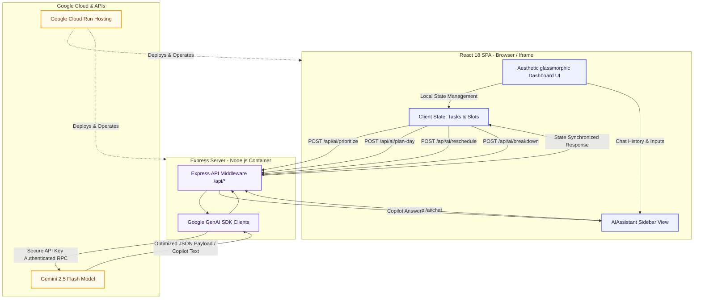
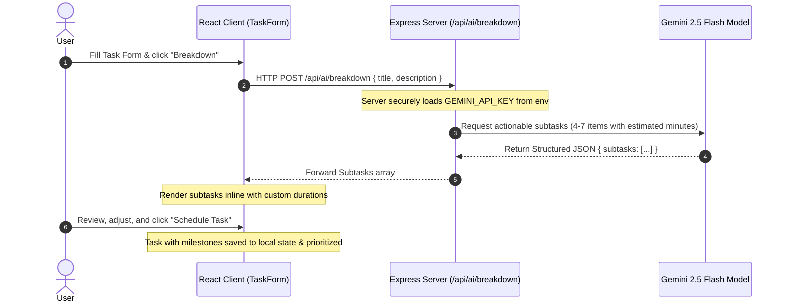
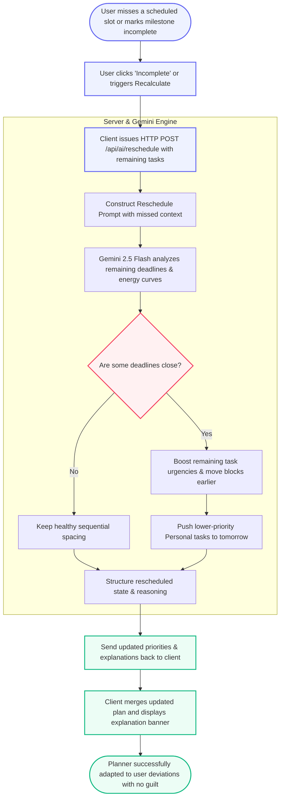
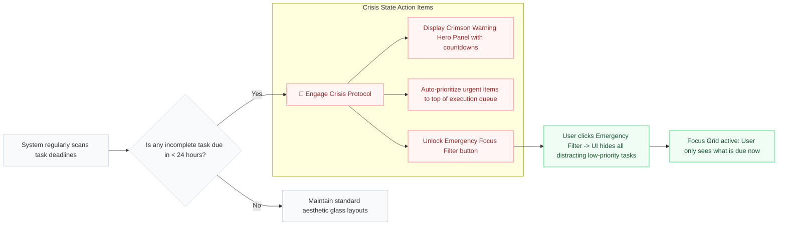
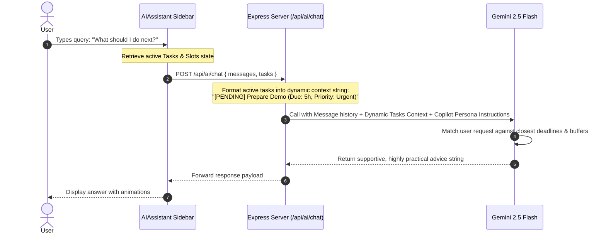

# Project Report : **DeadlineAI** 
### AI-Powered Smart Task Management & Productivity Assistant  
---

## 1. Problem Statement Selected

### The Procrastination & Rigid Planning Paradox
In modern productivity, traditional calendars, reminders, and linear "to-do list" tools fail to solve the actual root cause of task incompletion: **procrastination, cognitive overload, and planning rigidity**. 

1. **The Guilt and Abandonment Loop (Rigid Timetables):** Traditional planners ask users to create rigid, hourly timetables. However, when an unexpected delay occurs or the user procrastinates on a single slot, the entire timeline collapses. The user experiences guilt, feels overwhelmed by the "broken" schedule, and completely abandons the list for the day.
2. **Cognitive Friction in Bulky Goals:** When users add high-level items like *"Complete Research Paper"* to their task queue, they experience planning paralysis. Because the goal is not broken down into low-friction, concrete milestones, the human brain default-prioritizes easier, low-value activities.
3. **Imminent Deadline Panic (Lack of Crisis Protocols):** As multiple deadlines approach, users waste precious time frantically deciding which task to execute first, often miscalculating the trade-offs between nearest-deadline-wins vs. highest-effort-required, leading to preventable academic or professional failures.
4. **Passive Interfaces:** Planners are usually static databases requiring manual manipulation. They lack proactive encouragement, real-time coaching, or intelligent suggestions on how to adapt energy levels to a changing day.

---

## 2. Solution Overview

**DeadlineAI** is a reactive, AI-powered productivity companion designed specifically to rescue procrastinators and busy professionals by replacing rigid planning with **intelligent dynamic adaptation**.

Instead of a static checklist, DeadlineAI serves as an active execution engine. It analyzes tasks, deadlines, effort requirements, and categories to construct an optimized, high-focus schedule.

### Core Philosophy: "Dynamic Rescheduling"
The cornerstone of DeadlineAI is its tolerance for human deviation. If a user misses a scheduled work block or marks a task as incomplete, they do not face a broken schedule or guilt. Instead, the application's **Gemini-powered Dynamic Rescheduling Engine** recalculates remaining activities on-the-fly, gracefully shifting priorities, pushing flexible personal items if necessary, and writing clear, supportive reasoning explaining why the schedule was adapted and how deadlines are kept secure.

---

## 3. Key Features

*   **Smart Task Priority Queue:** Organizes tasks using an advanced Gemini decision model that evaluates deadline proximity, duration, and priority, outputting a clear execution sequence paired with natural-language priority explanations.
*   **AI Daily Planner (Hourly Timetable):** Automatically schedules your day into sequential blocks starting at 8:00 AM, incorporating customized mental buffer periods (10-20 min breaks) and flex slots (e.g., "Afternoon Walk", "Lunch") to avoid burnout.
*   **Dynamic Rescheduling Loop (Missed Slot Recovery):** If a task is marked incomplete or a milestone is missed, a single click engages the rescheduling engine. Gemini recalculates the remaining day, moves flexible tasks to tomorrow, and details its planning choices.
*   **Proactive Milestone Breakdown:** Users can request an instant AI breakdown of a bulky task. Gemini decomposes it into 4-7 actionable, bite-sized subtasks with realistic individual durations, lowering the barrier to entry.
*   **Crisis Protocol / Emergency Mode Hero Banner:** Automatically engages when tasks are due within 24 hours. The interface highlights critical items with pulsing warnings, activates a speed-focused execution plan, and unlocks a "Focus Grid Filter" to lock out distracting non-urgent tasks.
*   **DeadlineAI Chat Copilot:** A context-aware conversational sidekick that sits alongside your planner. It reads your active task list and provides instant answers to queries like *"What should I do next?"* or *"Can I finish everything today?"* with supportive coaching.
*   **Productivity Score Ring & Weekly Stats:** Evaluates your workload completion rate, showing productivity trends using beautiful visual charts to encourage habit retention.

---

## 4. System Architecture & Workflows

### A. High-Level System Architecture
The application runs as a secure, full-stack containerized service. Client-side state transitions drive server interactions, shielding secret API keys inside the backend.

---

### B. Smart Task Creation & Automatic Breakdown Workflow
This diagram illustrates the workflow of creating a task and breaking it down into small, digestible subtasks using Gemini.

---

### C. Dynamic Rescheduling & Recalculation Loop
This represents the primary differentiator of DeadlineAI: recovering from missed tasks or broken timetables.

---

### D. Emergency Crisis Protocol Workflow
The safety net workflow which engages automatically as deadlines creep near.

---

### E. Conversational Chat Copilot Context Flow
How the DeadlineAI Copilot answers questions while remaining context-aware of the user's current planner state.

---

## 5. Technologies Used

The architecture is built using high-performance, industry-standard modern frameworks:

1.  **React 18 & TypeScript:** Serves as the robust foundational framework, utilizing strong type definitions for tasks, planners, and schedules to avoid run-time rendering issues.
2.  **Vite:** Fast, lightweight asset compiler and development bundler.
3.  **Tailwind CSS:** Utilized with a customized modern typography scale and design primitives (glassmorphism, custom light/dark color variables) to build a distraction-free, premium visual interface.
4.  **Express (Node.js backend):** Acts as the secure server-side controller, handling asset routing, hosting production builds, and proxying requests to Google APIs.
5.  **Recharts:** Implements lightweight responsive SVG area charts for displaying weekly productivity completions.
6.  **Framer Motion (`motion/react`):** Powers smooth interface transitions, slide-in card entrances, pulse animations, and interactive scaling to provide instant feedback to user mouse actions.
7.  **Lucide React:** High-quality, clean vector icon package.

---

## 6. Google Technologies Utilized

DeadlineAI maximizes the capabilities of Google's cloud-native and AI developer ecosystem:

### 1. Google GenAI SDK (`@google/genai`)
The core intellectual engine of DeadlineAI is built on the official, modern Google GenAI library. It leverages:
*   **Model Selection (`gemini-2.5-flash`):** Used across all endpoints. It is selected for its sub-second response speeds, outstanding JSON structural parsing reliability, and cost-efficient execution.
*   **System Instructions:** Deeply integrates specific personas into the model (e.g., *“You are the Supportive Daily Planner Engine of DeadlineAI...”*), forcing empathetic, constructive, and highly tactical outputs rather than dry robotic alerts.
*   **JSON Response Outlining:** Prompts enforce rigid JSON structures, allowing the backend server to reliably clean, parse, and feed structured database state back to the React UI.

### 2. Google Cloud Run hosting
The entire full-stack Node.js server and integrated SPA client are deployed to production inside fully-managed **Google Cloud Run** serverless containers.
*   **Scale-To-Zero:** The deployment scales down to zero instances during inactive hours to minimize resource overhead, spinning up instantly on ingress traffic.
*   **Secure Secrets Management:** Integrates environment controls to inject private API credentials securely at startup, completely isolating key access from frontend browser environments.
